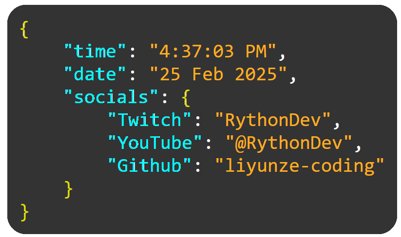
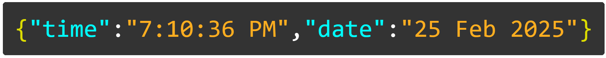

# JSON Locale Widget

---

This is a simple, customizable widget that displays the current time in a JSON-esque format.  Made for programmers, perfect for OBS or any other platform that supports embedding widgets.

## Features

- Automatically displays current time based on your timezone, no configuration needed
- Easy to customize colours and other styles (locale.css)
- Comes in 2 different styles: horizontal and vertical.

## Usage

### OBS

1. Open OBS
2. Add a new Browser Source
3. Navigate to folder, select `index.html` in either `horizontal` or `vertical` folder 
4. Configure width and height
    - Recommended vertical dimensions:
      - Width: 500
      - Height: 365
    - Recommended horizontal dimensions:
      - Width: 770
      - Height: 60

## Credits

- [RythonDev](https://twitch.tv/RythonDev)